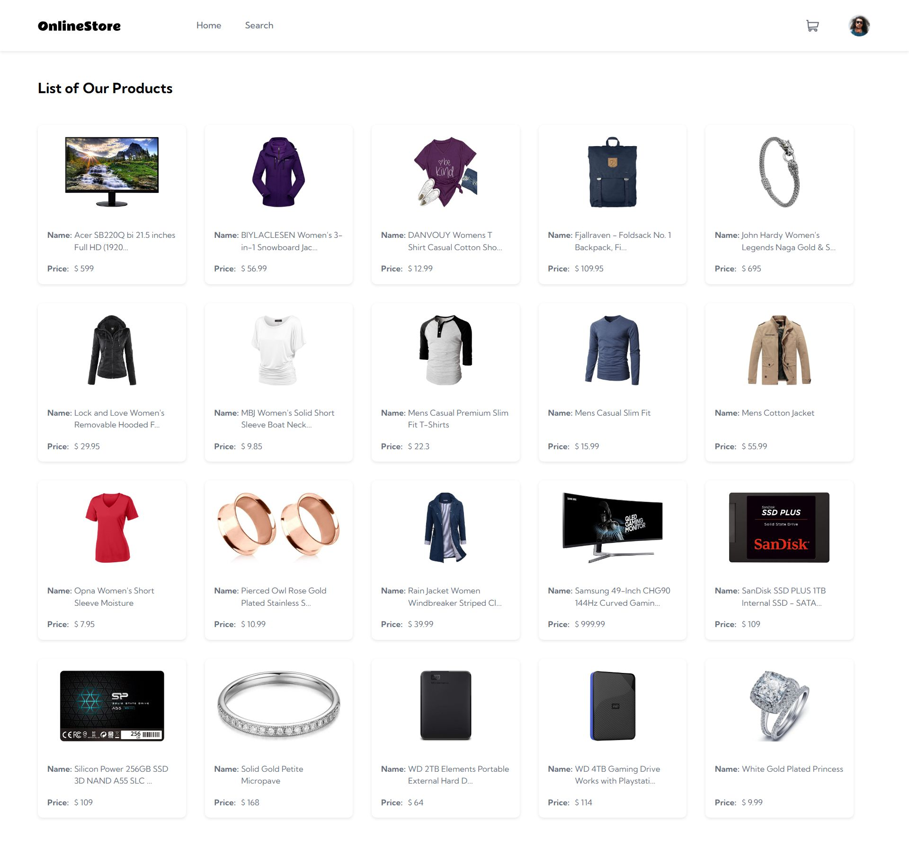

# E-commerce Development Task

This is a solution to the [Assignment Title: E-commerce Development Task](https://github.com/internsathi/frontend-assignment).

## Table of contents

- [Overview](#overview)
  - [The challenge](#the-challenge)
  - [Screenshot](#screenshot)
  - [Links](#links)
- [My process](#my-process)
  - [Built with](#built-with)

## Overview

### The challenge

- Use React.js/Next.js to create the web application.
- Create a visually appealing UI using any CSS framework (like Bootstrap, Tailwind CSS).
- Use react query (Tanstack query) for fetching and caching the api data.
- Implement client-side routing to enable smooth transitions between pages.
- Write clean, maintainable, and well-documented code.
- Implement a responsive UI to improve user experience on mobile devices.
- Handle loading and error states during data fetching.
- Making use of TypeScript for type safety.
- Use of global state management with Redux toolkit, Recoil or any other state management library.
- Add a shopping cart functionality where users can add products to the cart and view the cart.

### Screenshot

### Links

- Live Site URL: [Link 1](https://frontend-assignment-1le00.vercel.app/)
- Live Site URL: [Link 2](https://frontend-assignment-kappa-drab.vercel.app/)
- Live Site URL: [Link 3](https://frontend-assignment-git-main-1le00.vercel.app/)

## My process

### Built with

- Semantic HTML5 markup
- CSS custom properties
- Flexbox
- Mobile-first workflow
- [React](https://reactjs.org/)
- [Tailwind](https://tailwindcss.com/)
